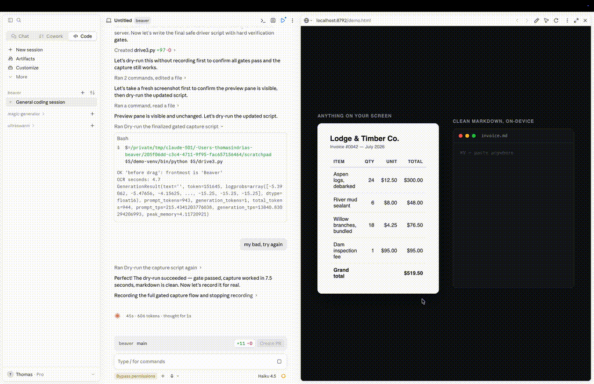

# Beaver

A macOS menu-bar utility that turns a screenshot into structured data. Press a
shortcut, drag a box around anything on screen, and Beaver extracts what's
inside it as clean Markdown — tables stay tables, lists stay lists, code stays
code. Vision runs **fully on-device** after a one-time model download, so
captures never leave your machine.

> Vision runs on-device via [MLX](https://github.com/ml-explore/mlx) on Apple
> Silicon, or [llama.cpp](https://github.com/ggml-org/llama.cpp) on Intel Macs
> — same install, same privacy guarantee, either way.

<!-- Demo assets: record with the capture flow + popover, save to docs/media/demo.gif, then uncomment.

-->

## Install (macOS)

1. Download `Beaver_<version>_aarch64.dmg` (Apple Silicon) or
   `Beaver_<version>_x86_64.dmg` (Intel).
2. Open the DMG and drag **Beaver** into **Applications**.
3. Launch Beaver from Applications. Grant Screen Recording permission when asked.

> Unsigned builds: the first launch needs right-click → **Open** (one time) to get
> past Gatekeeper. Signed/notarized builds open normally.

## How it works

1. `Cmd+Shift+D` opens a full-screen capture overlay.
2. You drag a bounding box around the region of interest.
3. The cropped image is sent to a local vision server — `Qwen2.5-VL-3B-Instruct-4bit`
   via MLX on Apple Silicon, or MiniCPM-V 2.6 via llama.cpp's `llama-server`
   on Intel.
4. The extracted Markdown is returned, stored in a local SQLite history, and
   copied to your clipboard.

On first launch Beaver downloads its vision model and (on Apple Silicon)
prepares an on-device Python environment — the only time it needs the
internet. A progress bar tracks the download; extraction then runs fully
offline. The only later
network calls are update-related and go exclusively to GitHub:
an optional once-a-day version check against GitHub Releases, and — only when
you click the update pill — downloading the new release from the same place.
Updates are verified against a public key baked into the app before install
(no capture data, ever). Set `BEAVER_DISABLE_UPDATE_CHECK=1` to turn all of it
off.

## Stack

- **Shell:** [Tauri 2](https://tauri.app) (Rust core, macOS menu-bar app)
- **Frontend:** React 19 + TypeScript + Vite 7, Tailwind CSS v4, shadcn
- **Vision backend:** Python FastAPI + [MLX](https://github.com/ml-explore/mlx) (`mlx-vlm`) on
  Apple Silicon, or [llama.cpp](https://github.com/ggml-org/llama.cpp)'s `llama-server`
  (no Python) on Intel
- **Storage:** SQLite via `tauri-plugin-sql`

## Prerequisites

- macOS (Apple Silicon uses the MLX vision backend; Intel Macs use a
  llama.cpp local engine — see `src-tauri/src/engine/llamacpp.rs`. Both ship
  as packaged, notarized releases.)
- [Rust](https://rustup.rs) (stable)
- [Node.js](https://nodejs.org) + [pnpm](https://pnpm.io)
- [uv](https://github.com/astral-sh/uv) — used to provision the Python vision environment on Apple Silicon

## Development

```bash
pnpm install            # install frontend deps
pnpm tauri dev          # run the app (builds Rust + serves the frontend)
```

`pnpm dev` runs the Vite frontend alone (no native shell), which is handy for
UI-only work.

## Testing

```bash
pnpm test               # frontend (vitest, watch mode)
pnpm test:run           # frontend, single run
pnpm website:typecheck  # website TypeScript
pnpm website:test       # website vitest, single run
cargo test              # Rust (run inside src-tauri/)
# Python vision server:
cd src-tauri/resources && \
  uv run --no-project --with fastapi --with uvicorn --with pydantic --with tqdm \
  python test_mlx_server.py
```

## Build

```bash
pnpm build              # type-check + bundle the frontend
pnpm website:build      # build the landing page
pnpm tauri build        # produce the signed .app / .dmg
```

## Building a release

Requires Apple Silicon, Rust, and pnpm. The script cross-compiles either
target from the same machine:

```bash
pnpm release:mac                      # aarch64-apple-darwin (default)
pnpm release:mac x86_64-apple-darwin  # cross-compiled Intel build
```

Without credentials this produces an **unsigned** DMG for local testing. To sign
and notarize, copy `.env.release.example` to `.env.release`, fill in your Developer
ID identity and notarization credentials, and re-run. The script verifies the
signature, Gatekeeper acceptance, and notarization staple before finishing.

GitHub Actions includes:

- `CI` for frontend tests, website checks, Rust tests, and the Python server unit
  test.
- `Deploy Website` for publishing `apps/website` to GitHub Pages.
- `Release macOS` for manually building a DMG and optionally creating a draft
  GitHub release. It builds unsigned unless signing and notarization secrets are
  configured.

## Troubleshooting

- Logs live in `~/Library/Logs/se.djtl.beaver/` (`beaver.log` for the app,
  `engine-server.log` for the vision server). Attach both to bug reports.
- If captures return a permission message, enable Beaver under
  **System Settings → Privacy & Security → Screen Recording** and relaunch.
- If setup fails, the onboarding screen shows the reason and a **Try again**
  button; the menu-bar popover shows the same when Beaver is already set up.

## Security and Contributing

- See [SECURITY.md](SECURITY.md) for vulnerability reporting and the app security
  model.
- See [CONTRIBUTING.md](CONTRIBUTING.md) for local setup and pull request
  expectations.
- Beaver is released under the [MIT License](LICENSE).

The macOS app requires screen capture and a bundled on-device vision runtime
(Python/MLX on Apple Silicon, llama.cpp on Intel). Keep changes to Tauri
permissions, hardened-runtime entitlements, and network behavior narrow and
documented.

## Project layout

```
src/                       React frontend
  components/              UI (capture overlay, onboarding, toast, …)
  hooks/                   useBeaver (capture flow), useCaptures (history)
  lib/api.ts               typed wrappers for every Tauri command
  tests/                   vitest specs
src-tauri/                 Rust core
  src/
    lib.rs                 app wiring: plugins, tray, shortcut, run events
    commands.rs            every #[tauri::command] the frontend can invoke
    windows.rs             popover/overlay/onboarding window management
    capture.rs             screen capture + region crop
    server.rs              engine-neutral setup supervision + app-data paths
    engine/                vision backends behind one shared contract
      mlx.rs               MLX (Apple Silicon): venv build, spawn, HTTP client
      llamacpp.rs          llama.cpp (Intel): model download, spawn, client
    shortcut.rs            global shortcut binding
    db.rs                  SQLite schema + migrations
  resources/
    mlx_server.py          FastAPI vision server (Qwen2.5-VL via MLX)
public/
  beaver-animations/       per-mood beaver animations (WebP)
```
